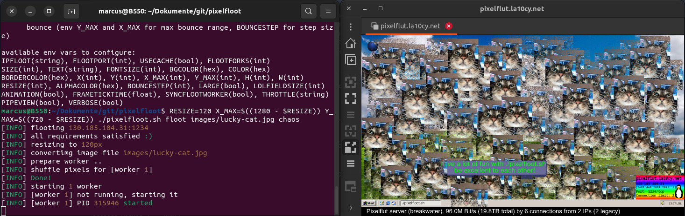

# pixelfloot

Origin: https://git.la10cy.net/DeltaLima/pixelfloot

an very simple and dirty pixelflut client to draw images, written in bash.
pixelfloot was built during the 37c3. in its actual state, its just a mess. I hope i will find time to put it in a more usable and readable format. 

## examples

- Display image: `./pixelfloot_bash.sh floot images/lucky-cat.jpg`
  - set position: `W=1337 H=420 ./pixelfloot_bash.sh floot images/lucky-cat.jpg`
- image random position: `./pixelfloot_bash.sh floot images/lucky-cat.jpg chaos`
  - wider "chaos-radio": `W=1000 H=600 ./pixelfloot_bash.sh floot images/lucky-cat.jpg chaos`
- image shake position: `./pixelfloot_bash.sh floot images/lucky-cat.jpg shake`
  - set the position  : `W=420 H=420 ./pixelfloot_bash.sh floot images/lucky-cat.jpg shake`
- move image with your cursor (needs `xdotool`): `./pixelfloot_bash.sh floot images/lucky-cat.jpg cursor`
- Use a color as "alpha" (remove background): `ALPHACOLOR=FF00FF ./pixelfloot_bash.sh floot images/cursor.ppm cursor`
- increase No of cuncurrent connections: `FLOOTFORKS=8 ./pixelfloot_bash.sh floot images/lucky-cat.jpg`
- specify IP and PORT: `IPFLOOT=127.0.0.1 FLOOTPORT=1337 ./pixelfloot_bash.sh floot images/lucky-cat.jpg`

```shell
$ ./pixelfloot_bash.sh help
./pixelfloot_bash.sh [floot|convertimg] [FILENAME|fill] ([MODE])
MODE: static (env $H and $W for position)
      chaos (env $H and $W for position range)
      shake (env $H and $W for position range)
      cursor

available env vars to configure:
RESIZE(int), ALPHACOLOR(hex), FLOOTFORKS(int), H(int), W(int)
```

Running on my Ryzen 4700G with [wellenbrecher](https://github.com/bits0rcerer/wellenbrecher) 1280x720 and three workers,
i get around 1,5Gbit/s localhost traffic.



## try it out

you can use my pixelflut server [pixelflut.la10cy.net](http://pixelflut.la10cy.net) and watch the board on the homepage, every 5s refreshed or connect by VNC to [pixelflut.la10cy.net:5900](vnc://pixelflut.la10cy.net:5900)
